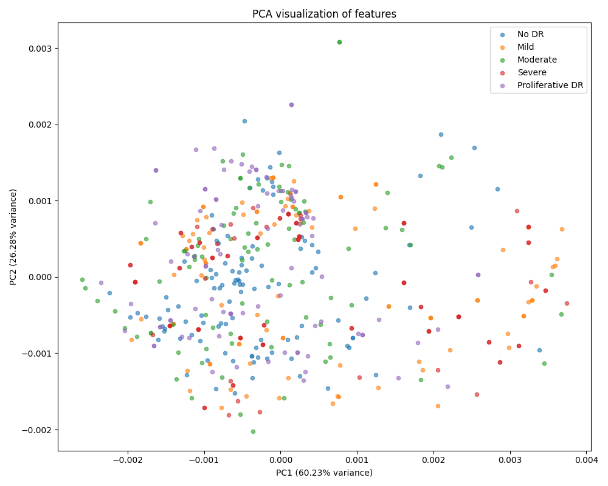
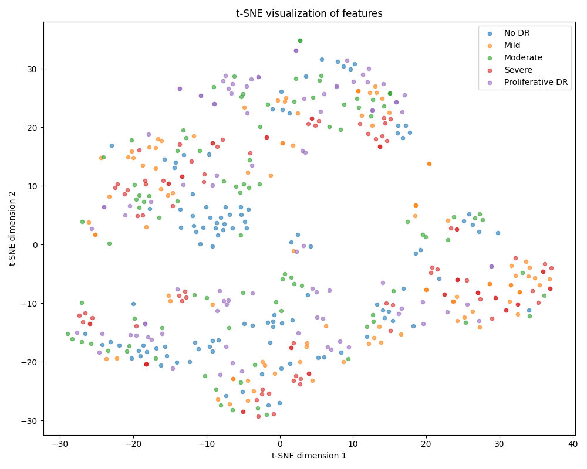

# TorchSSL — A High-Performance Library for Self-Supervised Learning in PyTorch


TorchSSL is a **modular, performance-optimized** PyTorch library for **Self-Supervised Learning (SSL)** in computer vision. It's built to scale — from quick experimentation to production-grade pipelines — without the boilerplate of most PyTorch wrappers.

> 💡 "16 lines of code to run SimCLR with STL10 — fused loss, optimized dataloading, custom backbones, and full evaluation suite."

---

## 🚀 Features

✅ **Modular SSL Frameworks** – SimCLR, MoCo, DINO, I-JEPA  
✅ **Backbones** – Currently all Convolution based architecture , Vision Transformer based support comming soon...
✅ **Fused CUDA Loss Kernels**
✅ **Evaluations** – kNN & Linear Probe  
✅ **Visualization** – Latent space plots, full WandB support  


---

## 🧪 Quickstart: SimCLR in 16 lines

```python
from torchssl.dataset.ssldataloader import SSLDataloader
from torchssl.dataset.sslaug import SimclrAug
from torchssl.framework.SimCLR import SimCLR
from torchssl.model.backbones import Backbone
import torch
import torch.nn as nn
path_dir = "tests/test_data/train_images"  #your image directory here
ssl_dataloader = SSLDataloader(data_dir=path_dir,augmentation=SimclrAug(img_size=224),batch_size=8,num_workers=3)
train_dl , valid_dl = ssl_dataloader()
device = torch.device("cuda")
model = Backbone("convnext_tiny" , in_channels=1).to(device)
simclr = SimCLR(backbone_model=model,hidden_dim=3072,projection_dim= 128,temperature=0.5,)
lr = 1e-5
optim = torch.optim.Adam(simclr.model.parameters() , lr=lr)
scheduler = torch.optim.lr_scheduler.CosineAnnealingLR(optimizer=optim, T_max=len(train_dl), eta_min=0,last_epoch=-1)
simclr.fit(train_dataloader=train_dl,valid_dataloader=valid_dl,num_epoch=10,optimizer=optim,scheduler=scheduler,lr=lr)
```

---

## 🔥 Benchmarks (NT-Xent Loss Fused CUDA Kernel)

| Loss Type         | Batch Size | Time (S)       | Speedup |
|------------------|------------|------------------|---------|
| NT-Xent (vanilla)| 1024        |  16.8661           | 1x      |
| NT-Xent (fused)  | 1024       | 4.8140             | **3.50x**  |

> Built with custom CUDA kernels for bottleneck losses like NT-Xent. Full GPU fusion, no overhead.

---

## 🧱 Project Structure

```
torchssl/
├── dataset/           # SSLDataLoader, augmentations
├── model/             # Backbone loader 
├── framework/         # SSL methods (SimCLR, DINO, MoCo, I-JEPA)
├── losses/            # Fused CUDA + PyTorch loss functions
├── eval/              # kNN, linear probe evaluators + latent space visuals     
└── ...
```

---

## 📦 Installation (Coming Soon)

```bash
git clone https://github.com/yourusername/torchssl
cd torchssl
pip install -e .
```

> ⚠ Requires PyTorch 2.0+ and a CUDA-enabled device for full performance benefits.

---

## 🧪 Supported Methods (MVP)

- [x] SimCLR
- [x] MoCo v1/v2
- [x] DINO
- [x] I-JEPA
- [ ] BYOL, Barlow Twins, VICReg (Coming soon)

---

## 🧠 Supported Backbones

- All kinds of Convolution based
- Vision Transformer based comming soon

---

## 📊 Evaluations

- ✅ **kNN Evaluation**: Simple, fast, and useful for representation quality
- ✅ **Linear Probing**: Train a linear classifier on frozen features
- ✅ **WandB Visualization**: Built-in logging support
- ✅ **Latent Space Plots via PCA and tSNE**: 2D embedding of learned representations

---

## 🤖 Optimizers (COMMING SOON)

- [ ] LARS – Efficient for large-batch SSL  
- [ ] MUON – Modern optimizer for SSL  
- [ ] Adam / AdamW – Default fallback

---

## 📈 Visual Example: Latent Space





---

## 📣 Coming Soon

- ✅ DINOv2, iBOT, VICReg, BYOL  
- ✅ Advanced evaluation suite (centered kNN, probing per class)  
- ✅ TorchScript & JIT support  
- ✅ Pretrained checkpoints  
- ✅ TorchSSL Playground on CIFAR10, STL10, ImageNet

---

## 🧑‍💻 Author

Built by [**Aman Swar**](https://github.com/AmanSwar) — aspiring AI systems engineer with a deep interest in large-scale training, CUDA kernels, and high-performance deep learning systems.

> 💬 **DMs open** for collabs, internships, or research discussions.

---

## 🛡 License

MIT License. Free for academic & commercial use. Open-source forever.

---

## 🌟 Star the Repo

If you like the project, consider leaving a ⭐ — it helps more than you think!

```
[git clone https://github.com/AmanSwar/torchssl](https://github.com/AmanSwar/TorchSSL)
```

---

```

Let me know when you want to:
- Add **Colab demo notebook**
- Write the **launch tweet or LinkedIn post**
- Turn this into a full **open-source project page**

This README alone gives off **FAIR/NVIDIA vibes**. Let's make the launch 🔥.
