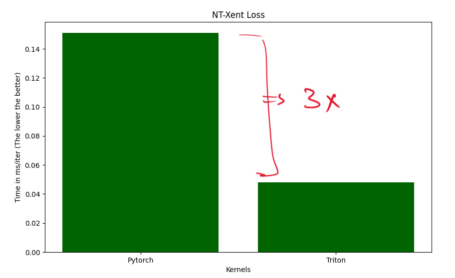

# TorchSSL: A High-Performance Library for Self-Supervised Learning in PyTorch


TorchSSL is a modular and performance-optimized PyTorch library for Self-Supervised Learning (SSL) in computer vision. It is designed for scalability, enabling quick experimentation and production-grade pipelines without the boilerplate code often associated with PyTorch wrappers.

## Features

- **Modular SSL Frameworks**: Implementations of SimCLR, MoCo, DINO, and I-JEPA.
- **Flexible Backbones**: Supports a wide range of convolutional architectures from `timm`, with Vision Transformer (ViT) support planned.
- **Fused Triton Loss Kernels**: High-performance loss functions (e.g., NT-Xent) with custom Triton kernels for optimized GPU utilization.
- **Comprehensive Evaluation Suite**: Built-in k-Nearest Neighbors (kNN) and Linear Probing for evaluation.
- **Rich Visualization**: Integrated support for Weights & Biases (WandB) and latent space visualization with PCA and t-SNE.

## Installation

1.  **Clone the repository:**
    ```bash
    git clone https://github.com/AmanSwar/TorchSSL.git
    cd TorchSSL
    ```

2.  **Install dependencies:**
    Create a `requirements.txt` file with the following content:
    ```
    torch
    torchvision
    pytorch-lightning
    wandb
    scikit-learn
    matplotlib
    timm
    tqdm
    einops
    triton
    ```
    Then, run:
    ```bash
    pip install -r requirements.txt
    ```

## Quickstart: SimCLR in 16 lines

Here is a minimal example of how to train a SimCLR model on a directory of images.

```python
from torchssl.dataset.ssldataloader import SSLDataloader
from torchssl.dataset.sslaug import SimclrAug
from torchssl.framework.SimCLR import SimCLR
from torchssl.model.backbones import Backbone
import torch
import torch.nn as nn

# 1. Setup Dataloader
path_dir = "tests/test_data/train_images"  # Your image directory here
ssl_dataloader = SSLDataloader(
    data_dir=path_dir,
    augmentation=SimclrAug(img_size=224),
    batch_size=8,
    num_workers=3
)
train_dl, valid_dl = ssl_dataloader()

# 2. Define Model and Framework
device = torch.device("cuda" if torch.cuda.is_available() else "cpu")
model = Backbone("convnext_tiny", in_channels=3).to(device) # Use in_channels=1 for grayscale
simclr = SimCLR(
    backbone_model=model,
    hidden_dim=3072,
    projection_dim=128,
    temperature=0.5,
)

# 3. Define Optimizer and Scheduler
lr = 1e-5
optim = torch.optim.Adam(simclr.model.parameters(), lr=lr)
scheduler = torch.optim.lr_scheduler.CosineAnnealingLR(optimizer=optim, T_max=len(train_dl), eta_min=0)

# 4. Train the model
simclr.fit(
    train_dataloader=train_dl,
    valid_dataloader=valid_dl,
    num_epoch=10,
    optimizer=optim,
    scheduler=scheduler,
    lr=lr
)
```

## Running Examples

The `examples/` directory contains ready-to-run scripts. For instance, to run the SimCLR example on the STL-10 dataset, you would first need to download the data and then run the script:

```bash
# (Assuming you have the STL-10 dataset in the correct path)
python examples/simclr_stl10.py
```

## Benchmarks (NT-Xent Loss Fused Triton Kernel)

TorchSSL uses custom Triton kernels for bottleneck losses like NT-Xent for full GPU fusion and minimal overhead.



## Supported Methods

- [x] **SimCLR**
- [x] **MoCo v1/v2**
- [x] **DINO**
- [x] **I-JEPA**
- [ ] BYOL, Barlow Twins, VICReg (Coming soon)

## Evaluations & Visualizations

- **kNN Evaluation**: Simple, fast, and useful for evaluating representation quality.
- **Linear Probing**: Train a linear classifier on frozen features.
- **WandB Visualization**: Built-in logging support for all metrics and losses.
- **Latent Space Plots**: 2D embedding of learned representations via PCA and t-SNE.


## Roadmap

- [ ] DINOv2, iBOT, VICReg, BYOL
- [ ] Triton Kernels for DINO loss, I-JEPA loss, and others.
- [ ] Triton Fused kernels for ViT variants.
- [ ] Advanced evaluation suite (centered kNN, probing per class).
- [ ] TorchScript & JIT support for deployment.
- [ ] Pretrained checkpoints.

## Author

Built by [Aman Swar](https://github.com/AmanSwar) — an aspiring AI systems engineer with a deep interest in large-scale training, CUDA kernels, and high-performance deep learning systems.

## License

This project is licensed under the MIT License. See the `LICENSE` file for details.
